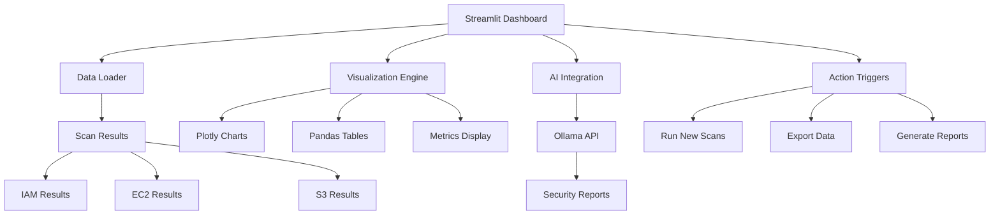

# Dashboard Overview

The CloudSecVision Dashboard is an interactive web interface built with Streamlit that provides comprehensive visualization and analysis of your AWS security scan results.

## Introduction

The dashboard transforms raw security scan data into actionable insights through intuitive visualizations, interactive charts, and detailed reports. It serves as the central hub for security analysis, providing both high-level overviews and detailed drill-down capabilities.

## Key Features

### 🏠 Unified Overview
- **Global Metrics**: Total issues across all AWS services
- **Risk Distribution**: Visual breakdown of security findings by severity
- **Service Summary**: Quick status of IAM, EC2, and S3 security posture
- **Trend Analysis**: Historical view of security improvements

### 📊 Interactive Visualizations
- **Plotly Charts**: Dynamic, responsive charts with hover details
- **Filterable Data**: Sort and filter findings by severity, service, or resource
- **Exportable Reports**: Download findings in multiple formats
- **Real-time Updates**: Live data refresh as new scans complete

### 🎯 Service-Specific Analysis
- **IAM Dashboard**: Policy analysis with risk categorization
- **EC2 Dashboard**: Security group visualization and network exposure
- **S3 Dashboard**: Bucket security matrix with compliance indicators

### 🤖 AI-Powered Insights
- **Intelligent Analysis**: AI-generated security reports with Ollama
- **Contextual Recommendations**: Tailored remediation advice
- **Risk Prioritization**: AI-driven severity assessment
- **Compliance Mapping**: Automated compliance framework alignment

## Architecture



## Getting Started

### Launch Methods

**Option 1: Launch Script (Recommended)**
```bash
./run_dashboard.sh
```

**Option 2: Direct Command**
```bash
streamlit run dashboard.py --server.port 8501
```

**Option 3: Custom Configuration**
```bash
streamlit run dashboard.py \
  --server.port 8502 \
  --server.headless true \
  --theme.base dark
```

### First Launch

When you first launch the dashboard:

1. **Initial Setup**: The dashboard checks for existing scan results
2. **Data Loading**: Loads previous scan results if available
3. **Interface Ready**: Dashboard becomes interactive at `http://localhost:8501`

### Navigation

The dashboard uses a **sidebar navigation** with the following sections:

- **🏠 Overview**: Global security metrics and summary
- **👤 IAM Analysis**: Identity and Access Management findings
- **🖥️ EC2 Analysis**: Security group and network configuration
- **🪣 S3 Analysis**: Storage bucket security assessment
- **🤖 AI Reports**: Comprehensive AI-powered analysis

## Dashboard Sections

### Overview Page

The main overview provides a high-level security dashboard:

```python
# Key metrics displayed
- Total Issues Found: 15
- Critical Issues: 3
- High Priority: 7  
- Medium Priority: 5
- Services Scanned: 3/3
```

**Visual Components:**
- **Risk Distribution Pie Chart**: Issues by severity level
- **Service Comparison Bar Chart**: Issues across IAM, EC2, S3
- **Timeline Chart**: Security improvements over time
- **Status Indicators**: Color-coded service health

### Service-Specific Pages

Each AWS service has a dedicated analysis page:

**IAM Analysis Page:**
- List of overly permissive policies
- Policy details with ARN information
- Risk categorization and recommendations
- AI-generated remediation steps

**EC2 Analysis Page:**
- Security group exposure matrix
- Network vulnerability visualization
- Port and protocol analysis
- Geographic access patterns

**S3 Analysis Page:**
- Bucket security configuration table
- Public access risk indicators
- Encryption and compliance status
- Data protection recommendations

## Interactive Features

### Real-Time Scanning

The dashboard includes action buttons to trigger new scans:

```python
# Scan trigger buttons
if st.button("🔍 Run IAM Scan"):
    run_iam_scan()
    st.success("IAM scan completed!")

if st.button("🖥️ Run EC2 Scan"):
    run_ec2_scan() 
    st.success("EC2 scan completed!")

if st.button("🪣 Run S3 Scan"):
    run_s3_scan()
    st.success("S3 scan completed!")
```

### Data Export

Export functionality for various formats:

```python
# Export options
csv_data = convert_to_csv(scan_results)
st.download_button(
    label="📥 Download CSV",
    data=csv_data,
    file_name="security_findings.csv",
    mime="text/csv"
)

json_data = json.dumps(scan_results, indent=2)
st.download_button(
    label="📥 Download JSON", 
    data=json_data,
    file_name="security_findings.json",
    mime="application/json"
)
```

### Advanced Filtering

Interactive filters for detailed analysis:

```python
# Filtering controls
severity_filter = st.multiselect(
    "Filter by Severity",
    ["CRITICAL", "HIGH", "MEDIUM", "LOW"],
    default=["CRITICAL", "HIGH"]
)

service_filter = st.selectbox(
    "Select Service", 
    ["All", "IAM", "EC2", "S3"]
)

date_range = st.date_input(
    "Date Range",
    value=[datetime.now() - timedelta(days=30), datetime.now()]
)
```

## Visualization Components

### Charts and Graphs

**Plotly Integration:**
```python
import plotly.express as px
import plotly.graph_objects as go

# Risk distribution pie chart
fig = px.pie(
    values=severity_counts.values(),
    names=severity_counts.keys(),
    title="Security Issues by Severity",
    color_discrete_map={
        "CRITICAL": "#ff4444",
        "HIGH": "#ff8800", 
        "MEDIUM": "#ffaa00",
        "LOW": "#44aa44"
    }
)
st.plotly_chart(fig)
```

**Interactive Tables:**
```python
import pandas as pd

# Create interactive findings table
df = pd.DataFrame(findings)
st.dataframe(
    df,
    use_container_width=True,
    column_config={
        "Severity": st.column_config.SelectboxColumn(
            "Severity",
            options=["CRITICAL", "HIGH", "MEDIUM", "LOW"]
        ),
        "Resource": st.column_config.LinkColumn("Resource")
    }
)
```

### Status Indicators

**Color-Coded Alerts:**
```python
# Dynamic alert styling based on findings
if critical_issues > 0:
    st.error(f"🚨 {critical_issues} critical issues require immediate attention")
elif high_issues > 0:
    st.warning(f"⚠️ {high_issues} high priority issues found")
else:
    st.success("✅ No critical security issues detected")
```

## Configuration

### Streamlit Configuration

Create `.streamlit/config.toml` for customization:

```toml
[theme]
primaryColor = "#667eea"
backgroundColor = "#ffffff"  
secondaryBackgroundColor = "#f0f2f6"
textColor = "#262730"
font = "sans serif"

[server]
port = 8501
headless = true
enableCORS = false
enableXsrfProtection = true

[browser]
gatherUsageStats = false
```

### Custom Styling

The dashboard includes custom CSS for enhanced appearance:

```css
.main-header {
    text-align: center;
    padding: 2rem 0;
    background: linear-gradient(90deg, #667eea 0%, #764ba2 100%);
    border-radius: 10px;
    margin-bottom: 2rem;
    color: white;
}

.metric-card {
    background: white;
    padding: 1rem;
    border-radius: 10px;
    box-shadow: 0 2px 4px rgba(0,0,0,0.1);
    border-left: 4px solid #667eea;
}

.critical-alert {
    background: #ffebee;
    border-left: 4px solid #f44336;
    padding: 1rem;
    border-radius: 5px;
}
```

## Performance Optimization

### Caching Strategy

```python
@st.cache_data(ttl=300)  # Cache for 5 minutes
def load_scan_results():
    """Load and cache scan results"""
    return {
        'iam': load_iam_results(),
        'ec2': load_ec2_results(), 
        's3': load_s3_results()
    }

@st.cache_resource
def initialize_ai_analyzer():
    """Initialize and cache AI analyzer"""
    return AIAnalyzer()
```

### Large Dataset Handling

```python
# Pagination for large result sets
def paginate_results(results, page_size=50):
    total_pages = len(results) // page_size + 1
    page = st.sidebar.number_input("Page", 1, total_pages, 1)
    
    start_idx = (page - 1) * page_size
    end_idx = start_idx + page_size
    
    return results[start_idx:end_idx]
```

## Troubleshooting

### Common Issues

**Dashboard Won't Start**
```bash
ModuleNotFoundError: No module named 'streamlit'
```
**Solution**: Install dependencies with `pip install -r requirements.txt`

**Port Already in Use**
```bash
OSError: [Errno 98] Address already in use
```
**Solution**: Use a different port `streamlit run dashboard.py --server.port 8502`

**No Data Displayed**
```
No scan results found. Please run a scan first.
```
**Solution**: Run scanners to generate data: `python main.py --service all`

### Debug Mode

Enable debug information:

```python
# Add to dashboard.py
import logging
logging.basicConfig(level=logging.DEBUG)

# Enable Streamlit debug mode
st.set_option('logger.level', 'debug')
```

## Advanced Usage

### Custom Widgets

Create custom dashboard components:

```python
def security_score_gauge(score):
    """Custom security score visualization"""
    fig = go.Figure(go.Indicator(
        mode = "gauge+number+delta",
        value = score,
        domain = {'x': [0, 1], 'y': [0, 1]},
        title = {'text': "Security Score"},
        delta = {'reference': 80},
        gauge = {
            'axis': {'range': [None, 100]},
            'bar': {'color': "darkblue"},
            'steps': [
                {'range': [0, 50], 'color': "lightgray"},
                {'range': [50, 80], 'color': "gray"}
            ],
            'threshold': {
                'line': {'color': "red", 'width': 4},
                'thickness': 0.75,
                'value': 90
            }
        }
    ))
    
    return fig
```

### Integration Hooks

Add external integrations:

```python
def send_to_jira(findings):
    """Create JIRA tickets for critical findings"""
    for finding in findings:
        if finding['severity'] == 'CRITICAL':
            create_jira_ticket(
                summary=f"Security Alert: {finding['resource']}",
                description=finding['issue'],
                priority="Highest"
            )

def webhook_notification(results):
    """Send webhook notifications"""
    webhook_url = st.secrets["webhook_url"]
    payload = {
        "text": f"Security scan completed: {len(results)} issues found",
        "findings": results
    }
    requests.post(webhook_url, json=payload)
```

## Next Steps

- [Dashboard Configuration](./configuration) - Customize the dashboard appearance and behavior
- [Custom Visualizations](./visualizations) - Create custom charts and reports
- [Integration Guide](./integrations) - Connect with external tools and services
- [Dashboard API](./api) - Programmatic access to dashboard functionality
