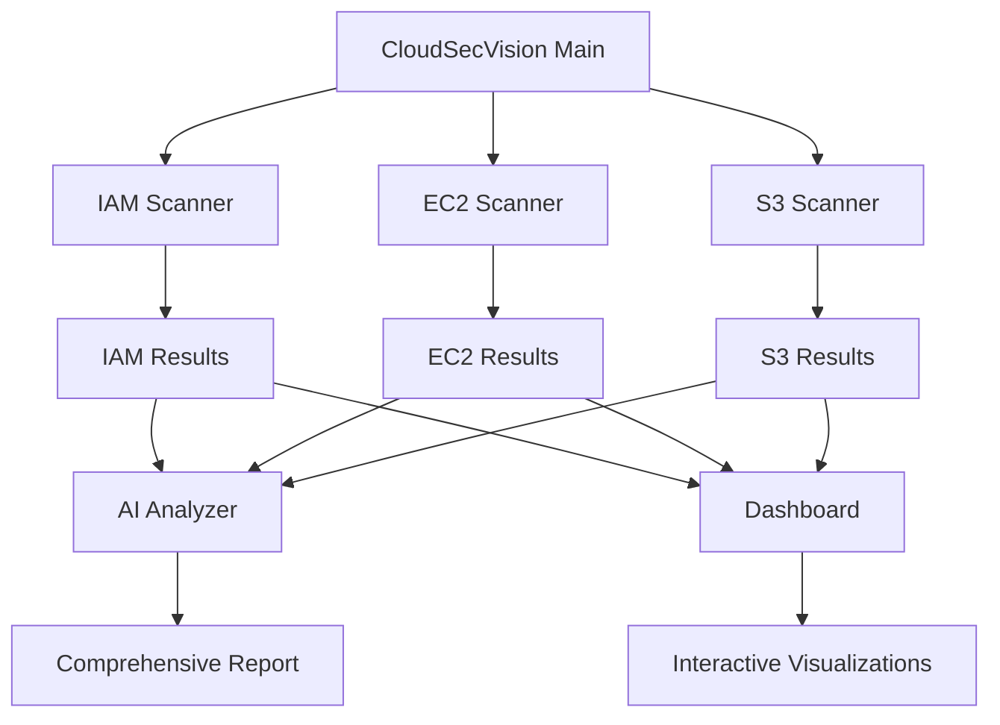

# Scanners Overview

CloudSecVision includes three specialized security scanners, each designed to assess different aspects of your AWS infrastructure. This overview provides a comprehensive understanding of all available scanners and their capabilities.

## Available Scanners

### 🔐 IAM Scanner
**File**: `scan/scan_iam.py`

The IAM Scanner identifies overly permissive Identity and Access Management policies that could pose security risks.

**Key Features**:
- Detects wildcard permissions (`"*"` in Action or Resource)
- Identifies policies with broad access scope
- Flags potentially dangerous privilege escalation vectors
- Analyzes only attached policies for efficiency

**Use Cases**:
- Compliance audits (SOC2, ISO 27001)
- Security assessments before production deployment
- Regular policy reviews and cleanup
- Privileged access management (PAM) validation

### 🖥️ EC2 Scanner
**File**: `scan/scan_ec2.py`

The EC2 Scanner examines security group configurations to identify overly permissive network access rules.

**Key Features**:
- Detects SSH (port 22) exposed to the internet (0.0.0.0/0)
- Identifies administrative ports open publicly
- Analyzes both IPv4 and IPv6 configurations
- Flags broad port ranges with public access

**Use Cases**:
- Network security assessments
- Infrastructure hardening reviews
- Incident response investigations
- Pre-deployment security validation

### 🪣 S3 Scanner
**File**: `scan/scan_s3.py`

The S3 Scanner performs comprehensive security checks on bucket configurations to prevent data exposure.

**Key Features**:
- Public access detection through policies and ACLs
- Encryption configuration validation
- Versioning and MFA Delete assessment
- Access logging verification
- Lifecycle policy evaluation

**Use Cases**:
- Data protection compliance (GDPR, HIPAA)
- Data leak prevention
- Storage cost optimization
- Backup and recovery planning

## Comparison Matrix

| Feature | IAM Scanner | EC2 Scanner | S3 Scanner |
|---------|-------------|-------------|------------|
| **Primary Focus** | Access Permissions | Network Security | Data Protection |
| **Scan Speed** | Fast | Fast | Medium |
| **Complexity** | Low | Low | High |
| **Risk Level** | High | High | Critical |
| **Compliance Impact** | High | Medium | Critical |

## Architecture Integration



## Running Scanners

### Individual Scanner Execution

```bash
# Run IAM scanner only
python -m scan.scan_iam

# Run EC2 scanner only
python -m scan.scan_ec2

# Run S3 scanner only
python -m scan.scan_s3
```

### Batch Execution

```bash
# Run all scanners
python main.py --service all

# Run specific scanner with AI analysis
python main.py --service iam --ai
python main.py --service ec2 --ai
python main.py --service s3 --ai
```

### Dashboard Integration

```bash
# Launch dashboard with all scanners
./run_dashboard.sh
```

## Output Formats

All scanners generate JSON reports in the `scan/results/` directory:

- `iam_scan_report.json` - IAM policy findings
- `ec2_scan.json` - Security group issues
- `s3_scan_report.json` - S3 bucket configurations

### Example Output Structure

```json
{
  "scanner_type": "iam",  
  "timestamp": "2024-01-15T10:30:00Z",
  "findings": [
    {
      "resource_id": "arn:aws:iam::123456789012:policy/MyPolicy",
      "severity": "HIGH",
      "issue": "Policy contains wildcard permissions",
      "recommendation": "Restrict permissions to specific resources"
    }
  ],
  "summary": {
    "total_resources": 25,
    "issues_found": 3,
    "risk_level": "MEDIUM"
  }
}
```

## Performance Considerations

### Optimization Tips

1. **IAM Scanner**: Only scans attached policies to reduce API calls
2. **EC2 Scanner**: Processes all security groups but focuses on critical ports
3. **S3 Scanner**: Most comprehensive but may take longer for accounts with many buckets

### Rate Limiting

AWS API rate limits may affect scan performance:
- IAM: 100 requests per second
- EC2: 100 requests per second  
- S3: 3,500 PUT/POST/DELETE and 5,500 GET requests per second

## Best Practices

### Before Scanning

1. **Verify Permissions**: Ensure your AWS credentials have necessary read permissions
2. **Network Connectivity**: Confirm stable internet connection for API calls
3. **Resource Limits**: Be aware of large environments that may take longer to scan

### During Scanning

1. **Monitor Progress**: Watch terminal output for scan progress
2. **Check Logs**: Review any error messages or warnings
3. **Resource Usage**: Monitor system resources during large scans

### After Scanning

1. **Review Results**: Analyze findings for false positives
2. **Prioritize Actions**: Focus on HIGH and CRITICAL severity issues first
3. **Document Changes**: Track remediation actions taken

## Integration with External Tools

### CI/CD Pipelines

```yaml
# Example GitHub Actions workflow
name: Security Scan
on: [push, pull_request]

jobs:
  security-scan:
    runs-on: ubuntu-latest
    steps:
      - uses: actions/checkout@v2
      - name: Setup Python
        uses: actions/setup-python@v2
        with:
          python-version: '3.8'
      - name: Install dependencies
        run: pip install -r requirements.txt
      - name: Run security scan
        run: python main.py --service all
        env:
          AWS_ACCESS_KEY_ID: ${{ secrets.AWS_ACCESS_KEY_ID }}
          AWS_SECRET_ACCESS_KEY: ${{ secrets.AWS_SECRET_ACCESS_KEY }}
```

### Monitoring Integration

```bash
# Export results to monitoring systems
cat scan/results/iam_scan_report.json | jq '.findings | length' | \
  curl -X POST -H 'Content-Type: application/json' \
  -d '{"metric":"iam_issues","value":"'$(cat)'}' \
  http://monitoring-endpoint/metrics
```

## Next Steps

- [IAM Scanner Details](./iam-scanner)
- [EC2 Scanner Details](./ec2-scanner)  
- [S3 Scanner Details](./s3-scanner)
- [Configuration Options](./configuration)
- [Advanced Usage](./advanced-usage)
